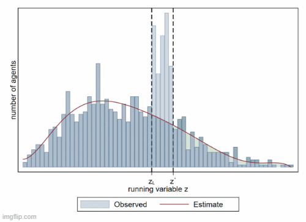
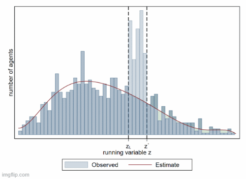

# rfbunch
Reduced form bunching estimation with multiple response variables in Stata. In development, bugs are likely. Report through GitHub or martin.eckhoff.andresen@gmail.com

##Alternative adjustment methods

##Italling development version
net install rfbunch, from("https://raw.githubusercontent.com/martin-andresen/rfbunch/master")
