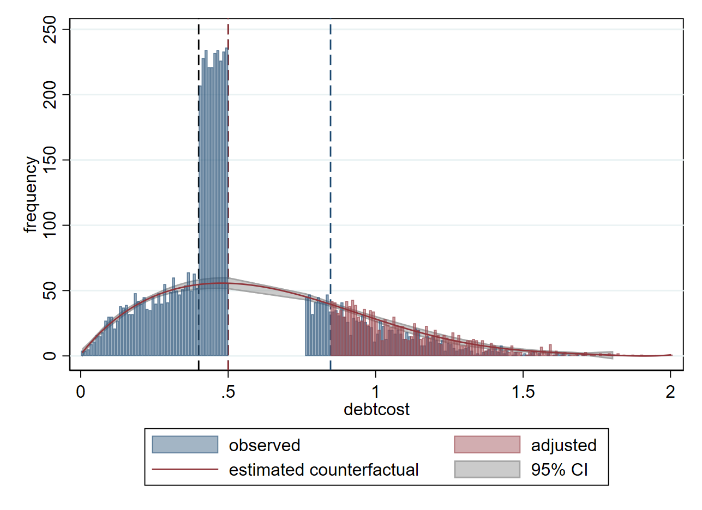
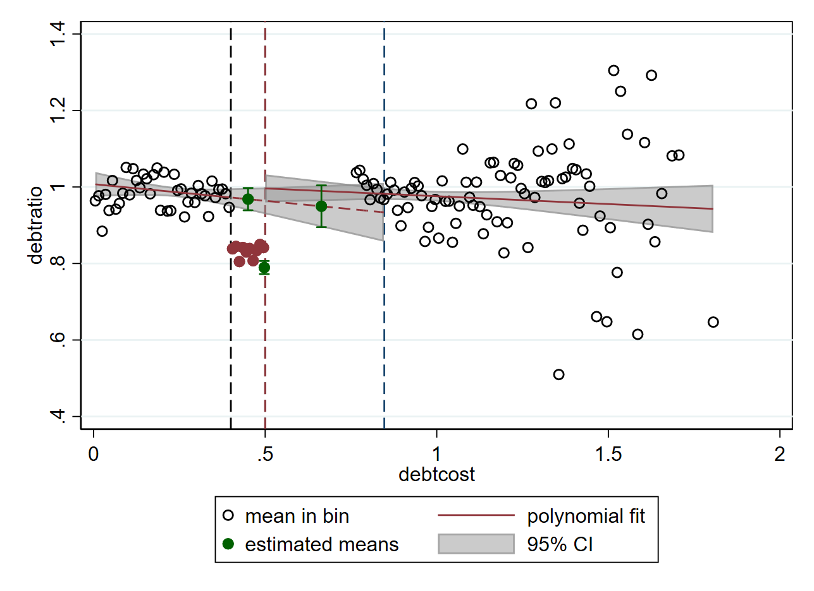

# rfbunch
Reduced form bunching estimation with multiple response variables in Stata. Implements various polynomial bunching estimators from Saez (2010), Chetty et. al (2011), Kleven and Waseem (2013), Diamond and Persson (2016) and Andresen and Thorvaldsen (2021). In development, bugs are likely. Report through GitHub or martin.eckhoff.andresen@gmail.com

## Estimates bunching 
 

## Alternative adjustment methods
 

## Installing development version
net install rfbunch, from("https://raw.githubusercontent.com/martin-andresen/rfbunch/master")
